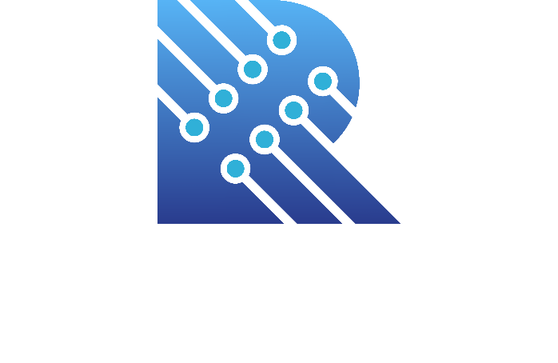

# About

---
The Ram Corporation, or RamCorp, is a development project started by RamGames in January 2023. The goal of the project is to establish a common ground for the storage and distribution of all projects set forth from the group and it's contributors.

# Types of Work

---
The Ram Corporation primarily works with the Java programming language. As the group's slogan may suggest, the main types of projects that are published are libraries to help integrate aspects of the working world that are not included in the Java language by de facto. However, the project does also include personal projects in the java language, such as Minecraft mods.

# How To Contribute

---
To Contribute to the group, it is highly suggested that the said person create a pull request or issue report on the matter. However, if you feel your skills may be a good fit for our group, feel free to contact us with one of the methods listed below in the "How To Contact" section

# How To Contact

---
To Contact someone within the Ram Corporation group, please use one of the following methods:

- RamGemes via Discord (@Ramixin)
- Everyone via Email (TheRamCorporation@gmail.com)